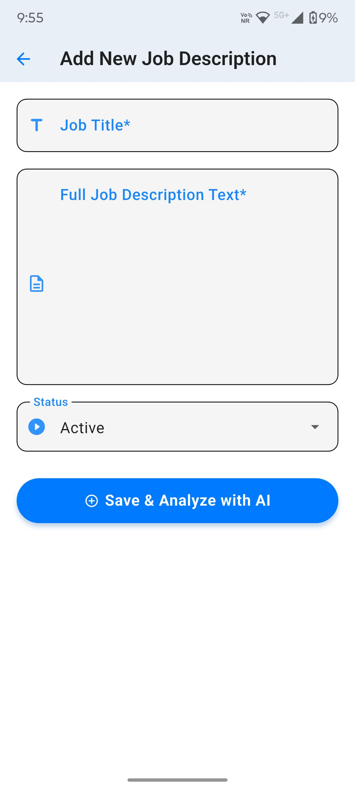
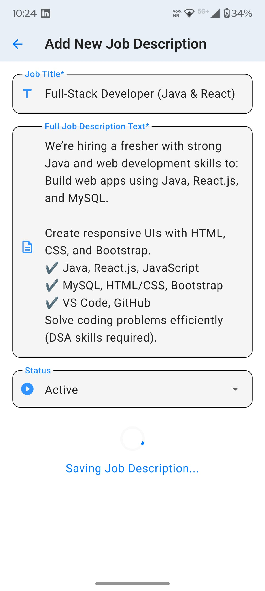
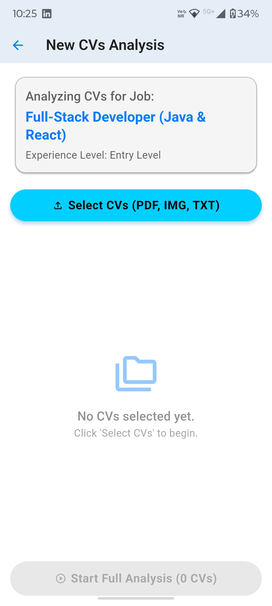
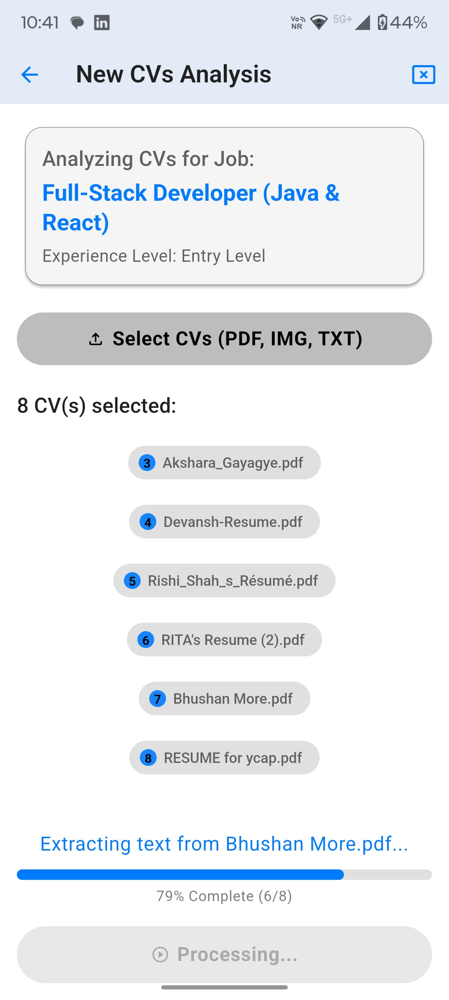
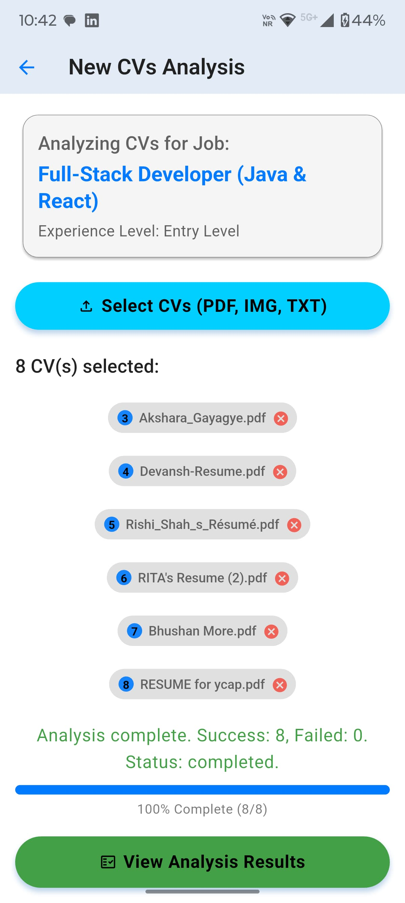
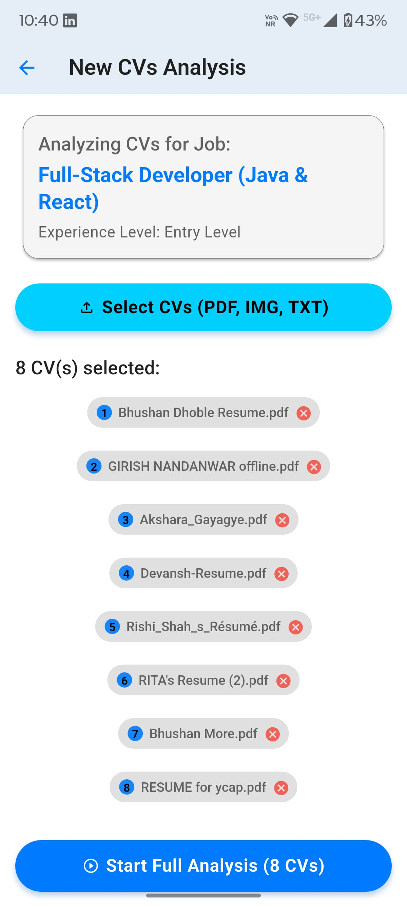
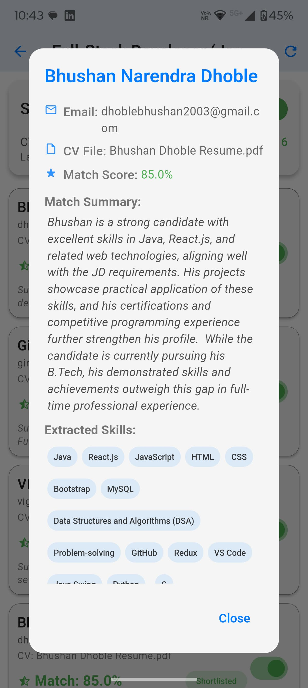
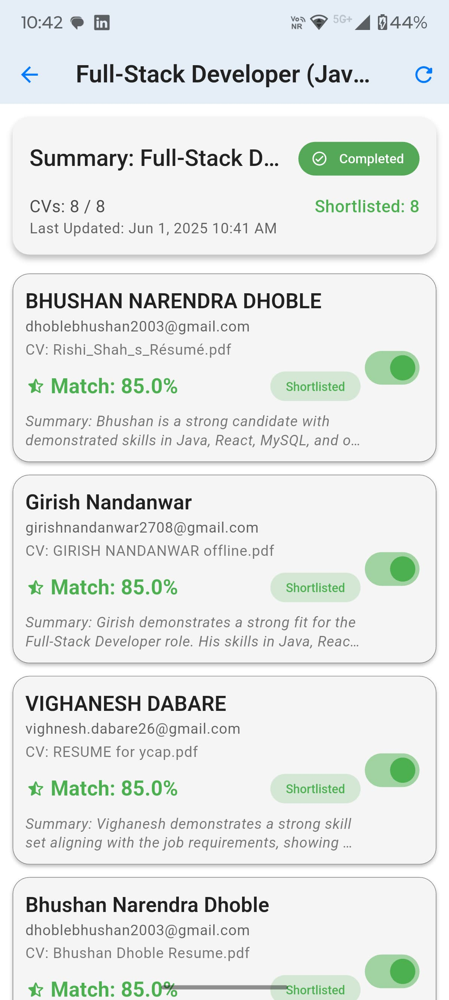
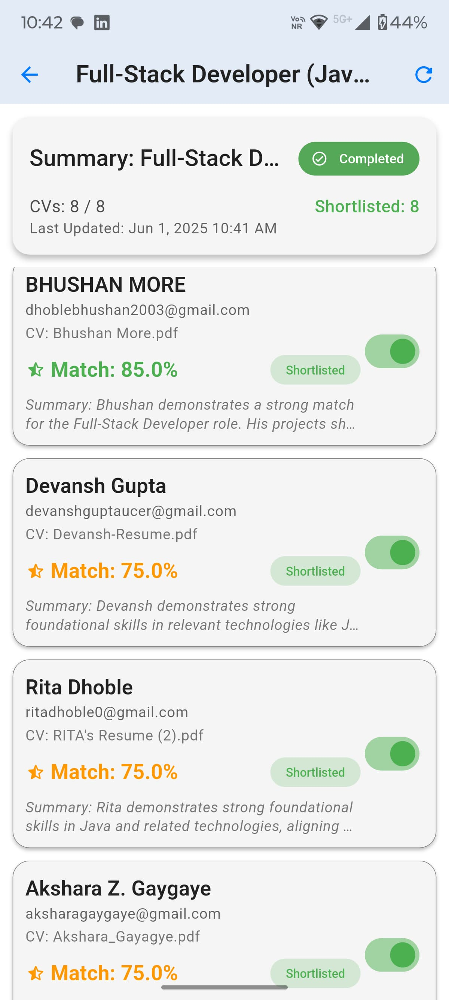
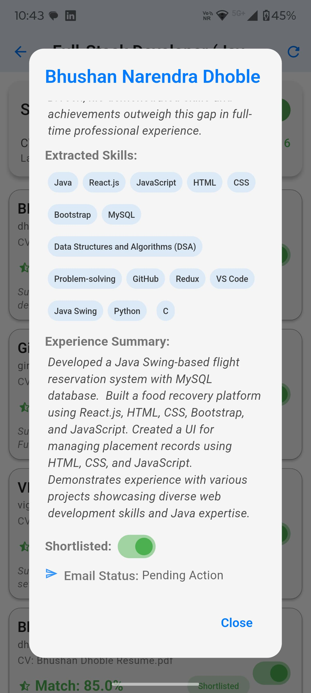

# 🚀 IntelliHire

<p align="center">
  
</p>

**Smart Hiring, Made Simple.**

Welcome to **IntelliHire**, your intelligent assistant for modern recruitment. Powered by **advanced AI**, it automates the most tedious parts of hiring—saving time, reducing bias, and helping you find top talent effortlessly.

---

## ✨ What IntelliHire Does

Hiring can be overwhelming. IntelliHire uses smart AI to:

* 🔍 Understand job requirements instantly.
* 📄 Extract insights from resumes (PDF, images, text).
* 🎯 Match candidates to job needs.
* ✅ Auto-generate shortlists.
* 📞 Help initiate interview outreach.

---

## 🎯 The Problem We're Solving

**Hackathon Problem ID: R1-05 - Enhancing Job Screening**

Recruitment challenges:

* ⏳ **Time-Consuming:** Screening one hire can take \~23 hours (Eddy.com).
* 💸 **Costly & Slow:** Manual tasks delay the process.
* ⚖️ **Prone to Bias:** Human screening can be inconsistent.
* 📈 **Hard to Scale:** Companies often receive more CVs than they can properly review.

**Result:** Delayed hiring, higher costs, and missed opportunities.

---

## 💡 Our Solution: IntelliHire AI Agents

We designed specialized backend agents to streamline hiring:

1. **JD Helper:** Parses and understands job descriptions.
2. **CV Helper:** Reads resumes and extracts essential data.
3. **Matching Agent:** Aligns resumes with job criteria.
4. **Shortlisting Agent:** Generates a top candidate list.
5. **Interview Agent:** Assists in initiating outreach.

**Benefits:**

* ⏱️ Huge time savings
* 🧠 AI-driven precision
* 💼 Ready-to-contact candidate lists
* 🤝 Recruiters can focus on people, not paperwork

---

## 🚀 Core Features

* **Smart JD Analysis:** Extracts and summarizes job requirements.
* **Bulk Resume Uploads:** Add up to 100 or more resumes at once (PDF, image, Word).
* **AI Resume Reader:** Parses content intelligently.
* **Match Scoring:** Evaluates candidate fit using AI.
* **Shortlisting Engine:** Auto-selects top candidates based on job match.
* **Interview Assistance:** Simplifies the next steps.
* **Job & Resume History:** Keeps all your past sessions saved.

---

## 🛠️ Tech Stack

* **Frontend:** Flutter (Dart) – Android & iOS support.
* **Backend:** Python Cloud Functions (Firebase).
* **AI Model:** Custom-trained LLM for parsing and matching.
* **Database:** Firebase Firestore.
* **Authentication:** Firebase Auth.

---

## 🌐 System Overview

### 🔁 Workflow

1. Recruiter adds job info.
2. JD Helper processes the description.
3. Recruiter uploads resumes.
4. CV Helper extracts and evaluates resume data.
5. Matching Agent scores resumes.
6. Shortlisting Agent filters top candidates.
7. Interview Agent helps begin outreach.

### 🧩 Architecture

* **Flutter App** – User-facing interface
* **Cloud Functions (Python)** – Executes backend AI logic
* **Firebase Auth + Firestore** – Secure login & data storage
* **AI Model (API Accessed)** – Powers all intelligent decisions

---

## 🤖 AI Helper Agents Breakdown

| Agent                  | Description                                 |
| ---------------------- | ------------------------------------------- |
| **JD Helper**          | Understands and summarizes job descriptions |
| **CV Helper**          | Reads, extracts, and interprets CV data     |
| **Matching Agent**     | Aligns candidate profiles with job needs    |
| **Shortlisting Agent** | Ranks and shortlists top candidates         |
| **Interview Agent**    | Supports outreach (via default email app)   |

---

## 📱 IntelliHire Screenshots

### App UI Highlights

<div style="display: flex; flex-wrap: wrap; justify-content: center; gap: 20px; text-align: center;">
🖥️ Splash & Job Description Pages
<div align="center"> <table> <tr> <td align="center"><b>Splash Screen</b></td> <td align="center"><b>Job Description Page 1</b></td> <td align="center"><b>Job Description Page 2</b></td> </tr> <tr> <td></td> <td></td> <td></td> </tr> </table> </div>

📄 CV Analysis Pages
<div align="center"> <table> <tr> <td align="center"><b>CV Overview</b></td> <td align="center"><b>CV Detail 1</b></td> <td align="center"><b>CV Detail 2</b></td> </tr> <tr> <td></td> <td></td> <td></td> </tr> </table> </div>
<div align="center"> <table> <tr> <td align="center"><b>Resume Viewer</b></td> <td align="center"><b>Candidate Analysis</b></td> <td align="center"><b>&nbsp;</b></td> </tr> <tr> <td></td> <td></td> <td></td> </tr> </table> </div>
✅ Shortlisting & Contact
<div align="center"> <table> <tr> <td align="center"><b>Shortlist View 1</b></td> <td align="center"><b>Shortlist View 2</b></td> <td align="center"><b>Email Screen</b></td> </tr> <tr> <td></td> <td></td> <td></td> </tr> </table> </div>

---

## 📁 Project Structure Overview

### `intellihire_app/`

```
intellihire_app/
├── lib/
│   ├── main.dart             # App entry point
│   ├── models/               # Data models
│   ├── screens/              # UI Screens
│   └── services/             # Backend communication
├── assets/
│   └── images/               # Screenshots and logo
├── pubspec.yaml              # Flutter dependencies & asset declaration
```

### `functions/`

```
functions/
├── main.py                   # AI logic via Cloud Functions
└── requirements.txt          # Python dependencies
```

Ensure your `pubspec.yaml` includes the asset directory:

```yaml
flutter:
  uses-material-design: true
  assets:
    - assets/images/
```

---

## 🧑‍💻 The IntelliHire Team

1. **Yogendra Karii**
2. **Mihir Valand**
3. **Pavan T.M**

---
